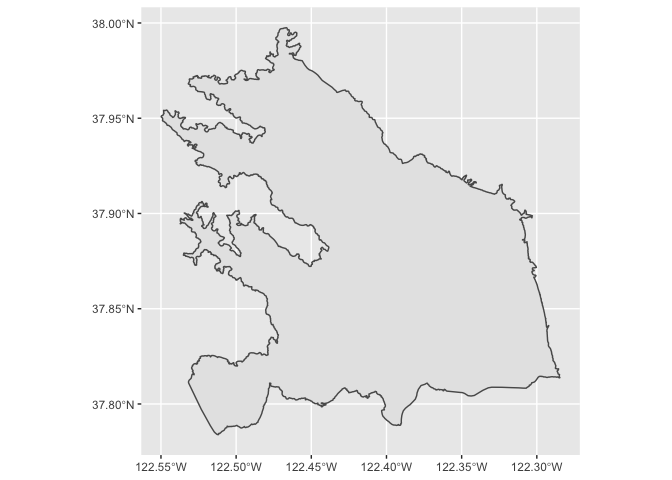
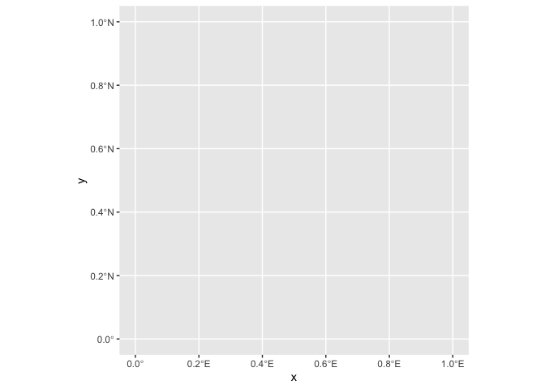

<!--- keep_md: true saves both an HTML and a markdown document (.md) that can be opened within GitHub--->

<!--- Setup and Rmd Dependencies --->


Emma was wondering how to clip a data set to only include the data within her project risk regions. There are two methods I can recommend:

1. Assign risk regions to data points using `st_join()` then remove NA region data with `dplyr::filter()` using `!is.na()`
2. Spatial subset using brackets `[]`

Here are some steps we'll need to take:

1. Load shapefile and tabular Data for SFEI microparticle data and station locations
2. Join Locations Data to SFEI Data
3. Remove any data with NA locations (sf package doesn't like this)
4. Convert tabular data to sf object
5. Transform CRS to match between risk regions and SFEI data
6. Subset using a `filter()` or brackets `[]`
<br><br>

## Data preparation
Emma is working with microparticle data from SFEI. This data originally came in a set of sheets within an excel document. These data originally did not have lat/long spatial data but the locations were provided in a follow-up email. Each sheet was exported individually and joined to the locations data by station code in ArcGIS, but doing this in R should be a straightforward task as well.
<br><br>

<details>
  <summary><b>Libraries</b></summary>

```r
library(here)
library(sf)
library(tidyverse)
```
</details>
<br>

#### Data Loading and Wrangling

```r
##############################
### Load Tabular Data Sets ###
##############################

SFEI.loc <- read.csv("Data/SFEI_MicroparticleData_2020SEP08_locations.csv", fileEncoding="UTF-8-BOM") # load with Excel BOM data removed to prevent odd characters in headers
SFEI.fish <- read.csv("Data/SFEI_MicroparticleData_2020SEP08_fish.csv", fileEncoding="UTF-8-BOM")

# Join Locations to Data
SFEI.fish.loc <- left_join(SFEI.fish %>% group_by(SampleID), # this duplicates some rows for an unknown reason
                           SFEI.loc,
                           by = c("StationCode" = "StationID")) %>%
  distinct(SampleID, .keep_all=T) # this removes duplicate rows from the join

# Remove blanks
SFEI.fish.loc.noblanks <- SFEI.fish.loc %>%
  filter(!is.na(Longitude)) # removes rows without lat/long data i.e. blanks

# Convert Data to Final SF Object
SFEI.fish.sf <- st_as_sf(SFEI.fish.loc.noblanks, coords = c("Latitude", "Longitude"), crs = "WGS84")

#########################
### Load Risk Regions ###
#########################

SFB.riskregions <- here("data/SFB_RiskRegions_Prelim20AUG2020.shp") %>% # path relative to main directory
  st_read() %>% # transforms shapefile CRS to WGS84 vs NAD83
  st_transform(st_crs(SFEI.fish.sf))
```
<br><br>

## Assign Risk Region and Filter

```r
SFEI.fish.sf <- st_join(SFEI.fish.sf, SFB.riskregions[1], left = T) %>% # left join of risk region numbers to SFEI data
  filter(!is.na(RiskRegion)) # removes rows with NA risk region i.e. those not within a risk region

#Simple Map
ggplot() +
  geom_sf(data = SFB.riskregions) +
  geom_sf(data = SFEI.fish.sf, color = "orange")
```

<!-- -->
 
If you wanted to map a single risk region:

```r
#Simple Map showing a single risk region
ggplot() +
  geom_sf(data = SFB.riskregions %>% filter(RiskRegion == 2)) +
  geom_sf(data = SFEI.fish.sf %>% filter(RiskRegion == 2), color = "orange")
```

<!-- -->

Or only the risk regions that contain data:

```r
#Simple Map showing a more complex query

ggplot() +
  geom_sf(data = SFB.riskregions %>% subset(RiskRegion %in% SFEI.fish.sf$RiskRegion)) +
  geom_sf_text(data = SFB.riskregions %>% subset(RiskRegion %in% SFEI.fish.sf$RiskRegion), aes(label = RiskRegion), color = "black") +
  geom_sf(data = SFEI.fish.sf, color = "orange")
```

<!-- -->


<br><br>

## Subset Using Spatial Brackets
This method is new to me. R now has built in functionality that can interpret spatial data using base R subsets (i.e. `[]`). This is an alternative to the `sf_join()` and `filter()`. Sleek! You'll notice that both methods result in sf objects that are identical.

```r
SFEI.fish.sf.subset <- SFEI.fish.sf[SFB.riskregions,]

# Simple map to show the results are the same
ggplot() +
  geom_sf(data = SFB.riskregions) +
  geom_sf(data = SFEI.fish.sf.subset, color = "orange")
```

<!-- -->
<br><br>

<details>
  <summary><b>R Session Information</b></summary>

```r
xfun::session_info('rmarkdown')
```

```
## R version 3.6.3 (2020-02-29)
## Platform: x86_64-w64-mingw32/x64 (64-bit)
## Running under: Windows 10 x64 (build 18363)
## 
## Locale:
##   LC_COLLATE=English_United States.1252 
##   LC_CTYPE=English_United States.1252   
##   LC_MONETARY=English_United States.1252
##   LC_NUMERIC=C                          
##   LC_TIME=English_United States.1252    
## 
## Package version:
##   base64enc_0.1.3 digest_0.6.27   evaluate_0.14   glue_1.4.2     
##   graphics_3.6.3  grDevices_3.6.3 highr_0.8       htmltools_0.5.0
##   jsonlite_1.7.2  knitr_1.30      magrittr_2.0.1  markdown_1.1   
##   methods_3.6.3   mime_0.9        rlang_0.4.9     rmarkdown_2.6  
##   stats_3.6.3     stringi_1.5.3   stringr_1.4.0   tinytex_0.28   
##   tools_3.6.3     utils_3.6.3     xfun_0.19       yaml_2.2.1     
## 
## Pandoc version: 2.9.2.1
```
</details>
<br><br>
