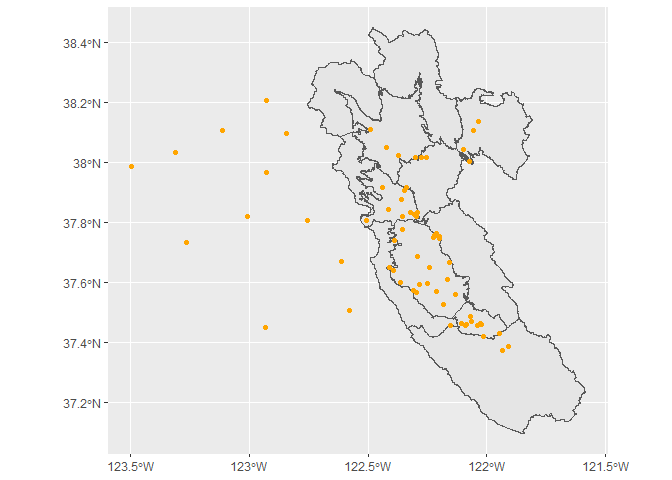
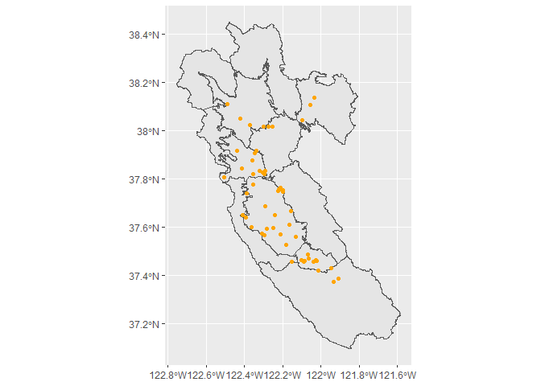

This markdown is a follow-up to subsetting data within an SFEI microplastics table; this document links individual particle data with its respective geographic location and sampling matrix (i.e. stormwater, sediment, etc.)

<details>
  <summary><b>Libraries</b></summary>

```r
library(data.table)
library(sf)
```

```
## Linking to GEOS 3.8.0, GDAL 3.0.4, PROJ 6.3.1
```

```r
library(tidyverse)
```

```
## -- Attaching packages --------------------------------------- tidyverse 1.3.0 --
```

```
## v ggplot2 3.3.2     v purrr   0.3.4
## v tibble  3.0.4     v dplyr   1.0.2
## v tidyr   1.1.2     v stringr 1.4.0
## v readr   1.4.0     v forcats 0.5.0
```

```
## -- Conflicts ------------------------------------------ tidyverse_conflicts() --
## x dplyr::between()   masks data.table::between()
## x dplyr::filter()    masks stats::filter()
## x dplyr::first()     masks data.table::first()
## x dplyr::lag()       masks stats::lag()
## x dplyr::last()      masks data.table::last()
## x purrr::transpose() masks data.table::transpose()
```

```r
library(knitr)
```
</details>
<br>

# Loading and Modifying Data

The SFEI tables do not have a key for matching between tables. The closest columns to keys are StationCode and SampleID. Multiple joins are required to acquire a data set that matches location data to the particle data. This table will ultimately allow us to subset the particles within the study area. Here are the steps we have to consider:

1. Load Data, Enforce "key" Column Names to be the Same if Necessary
2. Combine SFEI Tables with Station Data (eff, fish, manta, sed, sw)
3. Remove Blanks, Empty Rows and Unnecessary Columns
4. Join Combined SFEI Table to Location Data and Particles Data
5. Convert to `sf` Object and Subset

### Load Data
<!-- Loading Data Tables -->

```r
# Add SFEI Data Tables
SFEI.loc <- read.csv("Data/SFEI_MicroparticleData_2020SEP08_locations.csv", fileEncoding="UTF-8-BOM") %>%
  select(-OBJECTID) %>% # removes column generated by ArcGIS
  rename(StationCode = StationID) # changes StationID to StationCode to match SFEI tables
SFEI.fish <- read.csv("Data/SFEI_MicroparticleData_2020SEP08_fish.csv", fileEncoding="UTF-8-BOM")
SFEI.eff <- read.csv("Data/SFEI_MicroparticleData_2020SEP08_eff.csv", fileEncoding="UTF-8-BOM")
SFEI.manta <- read.csv("Data/SFEI_MicroparticleData_2020SEP08_manta.csv", fileEncoding="UTF-8-BOM")
SFEI.sw <- read.csv("Data/SFEI_MicroparticleData_2020SEP08_sw.csv", fileEncoding="UTF-8-BOM")
SFEI.sed <- read.csv("Data/SFEI_MicroparticleData_2020SEP08_sed.csv", fileEncoding="UTF-8-BOM")
SFEI.particles <- read.csv("Data/SFEI_MicroparticleData_2020SEP08_Particles.csv", fileEncoding="UTF-8-BOM")
SFEI.manta <- read.csv("Data/SFEI_MicroparticleData_2020SEP18_MantaFullCoordinates.csv", fileEncoding="UTF-8-BOM")
```

### Combine SFEI Tables, Remove Blanks/Empty Rows/Columns

```r
SFEI.StationTables <- list(SFEI.eff, SFEI.fish, SFEI.manta, SFEI.sed, SFEI.sw)

SFEI.ID.Table <- rbindlist(SFEI.StationTables, use.names=T, fill=T) # quickly combines list of tables and removes duplicate columns
SFEI.ID.Table <- SFEI.ID.Table %>%
  filter(!SampleID=="") %>% # remove empty rows
  filter(!SampleID %like% "Blank", !SampleTypeCode %like% "Blank") %>% # remove all blank rows
  select(intersect( colnames(SFEI.sw),  colnames(SFEI.eff)), # selects only matching columns from two smallest tables
         -contains("Collection"), # drop any columns containing the word collection
         -c(ProjectCode, EventCode, LocationCode, GeometryShape, PositionWaterColumn, SampleTypeCode)) # drops remaining unwanted columns
```

### Join to Location, Particles Data

```r
# Join Tables
SFEI.ID.loc <- left_join(SFEI.ID.Table, SFEI.loc, by = "StationCode") # joins sample matrix tables to sample locations
SFEI.ID.particles <- left_join(SFEI.particles, SFEI.ID.loc, by = "SampleID") %>% #joins sample matrix location table to particles table
  filter(!SampleID %like% "Blank", !SampleID %like% "blank") %>% # removes all blank rows
  filter(!is.na(Latitude)) # removes values with no lat/long
```

### Convert to sf Object

```r
# Convert Tables to sf
SFEI.ID.particles.sf <- st_as_sf(SFEI.ID.particles, coords = c("Longitude", "Latitude"), crs = "WGS84")

# Load Shapefiles
SFB.riskregions <- st_read("Data/SFB_RiskRegions_Prelim20AUG2020.shp") %>% # transforms shapefile CRS to WGS84 vs NAD83
  st_transform(st_crs(SFEI.ID.particles.sf))
```

```
## Reading layer `SFB_RiskRegions_Prelim20AUG2020' from data source `P:\Desktop\WWU Job 2020\R\GitHub\ClipToProjectBoundary\Data\SFB_RiskRegions_Prelim20AUG2020.shp' using driver `ESRI Shapefile'
## Simple feature collection with 12 features and 6 fields
## geometry type:  POLYGON
## dimension:      XY
## bbox:           xmin: -122.7568 ymin: 37.09693 xmax: -121.5857 ymax: 38.44869
## geographic CRS: NAD83
```

```r
ggplot() +
  geom_sf(data = SFB.riskregions) +
  geom_sf(data = SFEI.ID.particles.sf, color = "orange")
```

<!-- -->

### Subset Data

```r
# Subset particle data within project area
SFEI.ID.particles.sf <- SFEI.ID.particles.sf[SFB.riskregions,] # subsets only data within project study area
```

```
## although coordinates are longitude/latitude, st_intersects assumes that they are planar
## although coordinates are longitude/latitude, st_intersects assumes that they are planar
```

```r
ggplot() +
  geom_sf(data = SFB.riskregions) +
  geom_sf(data = SFEI.ID.particles.sf, color = "orange")
```

<!-- -->


